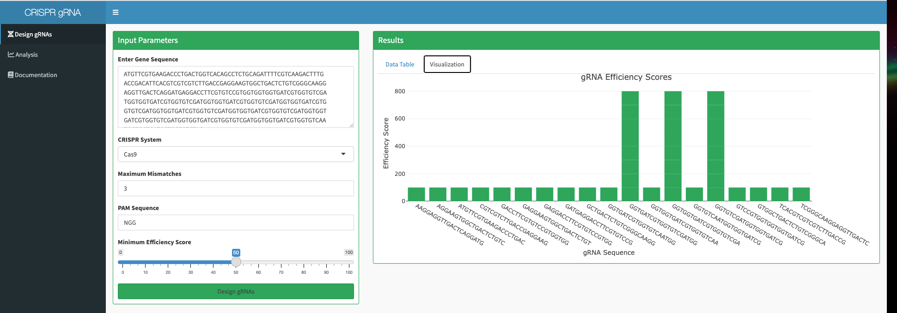

# CRISPR gRNA Designer Pro

A comprehensive R Shiny application for designing and evaluating CRISPR guide RNAs (gRNAs) with support for multiple CRISPR systems and advanced analysis capabilities.

## Features

- **Multi-system compatibility**: Support for Cas9, Cas12a, and Cas13 systems
- **Intelligent scoring**: Advanced efficiency and specificity analysis algorithms
- **Off-target prediction**: Comprehensive safety evaluation and visualization
- **Interactive interface**: Real-time parameter adjustment and result visualization
- **Export capabilities**: Results available for downstream analysis

## Application Interface

### Input & Parameter Configuration


The main interface allows users to input target DNA sequences and configure CRISPR system parameters including PAM sequences, mismatch tolerance, and efficiency thresholds.

### Results Visualization


Real-time visualization of gRNA efficiency scores, with sortable tables displaying sequence information, targeting positions, and calculated metrics.

### Off-target Analysis


Comprehensive off-target analysis featuring heatmap visualizations and specificity scoring to ensure safe and effective gRNA selection.

### Documentation


Built-in documentation provides guidance on parameter selection, interpretation of results, and best practices for CRISPR gRNA design.

## Installation

### Prerequisites
- R version 4.0.0 or higher
- Required R packages (automatically installed via dependency script)

### Setup
```bash
git clone https://github.com/winniecook/crispr-guide-designer-rshiny.git
cd crispr-guide-designer-rshiny
```

```r
# Install dependencies
source("install_dependencies.R")

# Launch application
shiny::runApp()
```

## Usage

1. **Sequence Input**: Enter your target DNA sequence in the provided text area
2. **System Selection**: Choose appropriate CRISPR system (Cas9, Cas12a, or Cas13)
3. **Parameter Configuration**: Adjust mismatch tolerance, PAM sequences, and efficiency thresholds
4. **Analysis**: Generate results and review efficiency scores, specificity metrics, and off-target predictions
5. **Export**: Download results for further analysis or integration into experimental workflows

## Scoring Methodology

### Efficiency Scoring
- GC content optimization (30-70% range)
- Position-specific nucleotide preferences
- Secondary structure considerations
- Homopolymer run assessment

### Specificity Analysis
- Genome-wide off-target search algorithms
- Mismatch penalty calculations
- Position-weighted scoring matrices

## Technical Implementation

Built using the R Shiny framework with the following core dependencies:
- `Biostrings` for sequence analysis
- `plotly` for interactive visualizations
- `DT` for dynamic data tables
- `shinydashboard` for professional UI components

## File Structure

```
crispr-guide-designer-rshiny/
├── app.R              # Main application logic
├── helpers.R          # Core analysis functions
├── docs.md           # Application documentation
├── tests/            # Unit testing framework
└── README.md         # Project documentation
```


## Citation

If you use this tool in your research, please cite:
```
CRISPR gRNA Designer Pro. Available at: https://github.com/winniecook/crispr-guide-designer-rshiny
```
